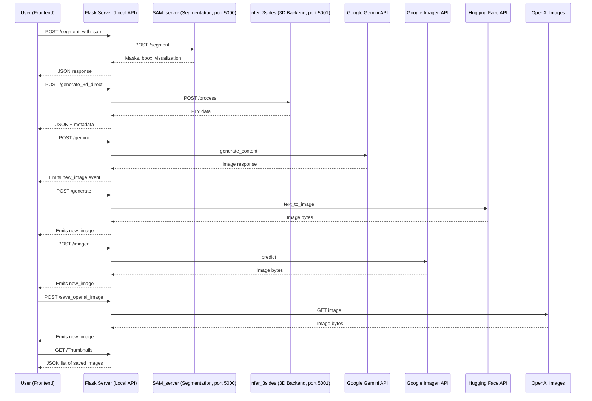

# Human_AI2D_ImageGen  

**Generate, iterate, and transform text into images — and images into 3D models — with multi-provider AI.**  

---

## ✨ Overview  

**Human_AI2D_ImageGen** is a loccally hosted, full-stack web application for **AI-powered image generation, editing, segmentation, and 3D reconstruction**.  
## Demo


It integrates **external AI providers** with **VM-hosted machine learning models** into one workflow:  

- 🌐 **External AI Providers (Cloud APIs)**  
  - **OpenAI** → DALL·E, GPT-Image  
  - **Google** → Imagen, Gemini 2.0 Flash  
  - **Hugging Face** → FLUX.1-schnell, SDXL  

- 💻 **Local ML Models (VM)**  
  - **[SAM2 (Segment Anything Model 2)](https://github.com/facebookresearch/sam2)** → segmentation (`SAM_server.py`)  
  - **[LGM (Large Multi-View Gaussian Model)](https://github.com/3DTopia/LGM)** → 3D reconstruction (`infer_3sides.py`)  

**Key Features**  
- 🔄 Real-time WebSocket updates during generation  
- 🖼️ Persistent gallery with prompts, descriptions, and thumbnails  
- ✍️ Iteration with Gemini for refinement & extension  
- ✂️ SAM2-powered segmentation and mask extraction  
- 🧩 Full **2D → 3D pipeline** using LGM (`.ply` export)  
- 💾 Local storage with timestamped filenames  

---

## 🛠️ Built With  

- [React](https://react.dev/) — Frontend  
- [Flask](https://flask.palletsprojects.com/) — Backend API  
- [Socket.IO](https://socket.io/) — Real-time communication  
- [Hugging Face Hub](https://huggingface.co/) — SDXL & FLUX inference  
- [OpenAI API](https://platform.openai.com/) — DALL·E & GPT-Image  
- [Google Vertex AI](https://cloud.google.com/vertex-ai) — Imagen & Gemini  
- [Pillow (PIL)](https://python-pillow.org/) — Image preprocessing  
- [SAM2](https://github.com/facebookresearch/sam2) — Segmentation (VM)  
- [LGM](https://github.com/3DTopia/LGM) — 3D reconstruction (VM)  

---

## 📂 Project Structure  

```plaintext
Human_AI2D_ImageGen/
│
├── .vscode/                 # VSCode project settings
├── node_modules/            # React dependencies
├── src/                     # React frontend app
│   ├── assets/              # Static images, CSS
│   ├── components/          # Modular UI components
│   ├── lib/                 # Utility functions
│   ├── App.js               # Main React component
│   └── index.js             # Entry point
│
├── server/                  # Flask backend + VM services
│   ├── 3d_models/           # Output `.ply` meshes from LGM
│   ├── generated_images/    # Saved/generated images
│   ├── segmented_images/    # Image masks/outputs from SAM2
│   ├── VM_Server/           # Local ML services (SAM2 & LGM)
│   │   ├── SAM_server.py    # Segmentation (SAM2)
│   │   └── infer_3sides.py  # 3D reconstruction (LGM)
│   ├── image_generator.py   # Main Flask app (API routes)
│   ├── sa_key.json          # Google service account key
│   └── .env                 # Runtime environment variables
│
├── .env                     # Global environment config (if needed)
├── .env.example             # Template for setting env variables
├── .gitignore               # Git ignore rules
├── package.json             # React frontend dependencies
├── package-lock.json        # Exact dependency tree
├── README.md                # Documentation

```

---

## 🚀 Running the System  

### 1️⃣ Backend (Flask)  
```bash
cd server
python3 -m venv venv
source venv/bin/activate      # Windows: venv\Scripts\activate
pip install -r requirements.txt
python image_generator.py     # runs on http://0.0.0.0:5000
```

### 2️⃣ Frontend (React)  
```bash
cd public
npm install
npm start                     # runs on http://localhost:3000
```

### 3️⃣ VM Services  

#### 🖼️ Segmentation (SAM2)  
**Prerequisites**  
- Python 3.10+ with PyTorch  
- SAM2 dependencies installed  
- Model weights: `sam_vit_h_4b8939.pth`  

**Startup**  
```bash
cd ~/SAM/sam2
source ../env/bin/activate
python SAM_server.py
```

#### 🧩 3D Reconstruction (LGM)  
**Prerequisites**  
- CUDA-enabled GPU  
- Python 3.9+ with PyTorch (CUDA)  
- LGM dependencies installed  

**Startup**  
```bash
cd ~/LMGM/LGM
source ../LGMenv_2/bin/activate
python infer_3sides.py big --resume pretrained/model_fp16_fixrot.safetensors --workspace output_test
```

---

## 🌐 AI Providers vs Local Models  

- **Cloud Providers (API keys required)**  
  - OpenAI → `/save_openai_image`  
  - Hugging Face → `/generate`  
  - Google (Imagen, Gemini) → `/imagen`, `/gemini`  

- **Local VM Models (Flask ↔ VM via HTTP)**  
  - SAM2 (Segmentation) → `/segment_with_sam`  
  - LGM (3D Reconstruction) → `/generate_3d_direct`  

---

## 🖥️ System Workflow  



---

## ⚙️ Environment Setup  

Create `.env` inside `server/`:  

```ini
HF_API_TOKEN=your_huggingface_token_here
GOOGLE_CLOUD_PROJECT=your_gcp_project_id
GOOGLE_APPLICATION_CREDENTIALS=/path/to/sa_key.json
```

- Place `sa_key.json` (Google service account key) in `server/`.  

---

## 🎨 Usage  

1. Start **Flask backend** + **React frontend**  
2. Launch **SAM2** + **LGM** inside the VM  
3. Open the UI → [http://localhost:3000](http://localhost:3000)  
4. Select a provider (**OpenAI**, **Hugging Face**, **Google**)  
5. Enter prompt → generate images  
6. View saved generations in **Gallery**  
7. Use **Gemini iteration** or **SAM2 segmentation** for refinements  
8. Convert regions into **3D models (`.ply`)** via **LGM**  

---

## 📡 API Endpoints  

### Hugging Face  
```http
POST /generate
{
  "prompt": "A medieval city at sunset",
  "model": "black-forest-labs/FLUX.1-schnell",
  "provider": "together"
}
```

### Google Imagen  
```http
POST /imagen
{
  "prompt": "A futuristic robot portrait",
  "model": "imagen-4.0-generate-preview-06-06",
  "size": "1024x1024"
}
```

### Google Gemini (iteration)  
```http
POST /gemini
{
  "prompt": "Add a golden crown",
  "image_filename": "previous_prompt__timestamp.png",
  "model": "gemini-2.0-flash-preview-image-generation"
}
```

### Segmentation (SAM2)  
```http
POST /segment_with_sam
{
  "image_url": "/generated_images/example.png",
  "input_points": [[100, 150]],
  "input_labels": [1]
}
```

### 2D → 3D Conversion (LGM)  
```http
POST /generate_3d_direct
{
  "image_url": "/generated_images/example.png",
  "mask_data": "data:image/png;base64,...."
}
```

---

## 📌 Notes  

- Requires **GPU-accelerated VM** for SAM2 + LGM.  
- Cloud APIs (OpenAI, Hugging Face, Google) need active tokens/credentials.  
- All generated assets are **timestamped** for reproducibility.  

### 🚧 Work in Progress  
- **Reset feature:** A button to re-align the 3D object perfectly over the 2D image (including position and rotation).  
- **Improvement 1:** Adjusting the size and initial placement of the `.ply` file so that the 3D object (e.g., hat) matches the scale and position of the corresponding 2D object.  
