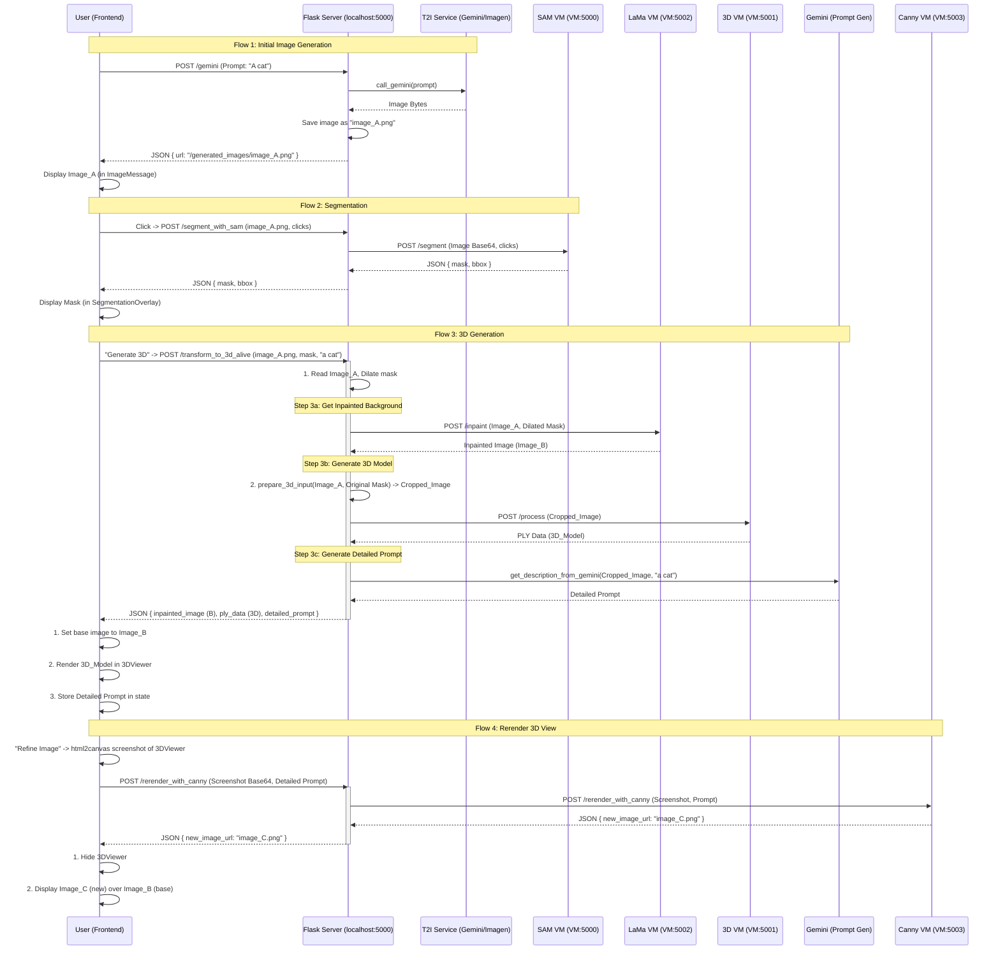

# Human_AI2D_ImageGen

**Generate, iterate, and transform text into images — and images into 3D models — with multi-provider AI.**

---

## ✨ Overview

Current AI image generators are powerful but often feel like a "black-box". They lack precise spatial control.

This project transforms 2D generation from a "prompt-based process into a **controllable, interactive spatial experience**".

It introduces a **3D manipulation layer** that solves this problem. Instead of just prompting, your workflow becomes:

1.  **Stage a 3D Scene:** Directly grab, move, rotate, and scale 3D "proxies" of objects.
2.  **Generate a 2D Image:** The system renders a high-quality 2D image that is *spatially consistent* with your 3D layout.

The core philosophy is **"manipulate in 3D, render in 2D"**. This gives you the power to **"direct rather than merely prompt"** and brings true geometric awareness to the creative process.

This application serves as the functional prototype for this research, integrating:
- 🌐 **External AI Providers (Cloud APIs)**
  - **OpenAI** → DALL·E
  - **Google** → Imagen, Gemini 2.0 Flash
  - **Hugging Face** → FLUX.1-schnell
- 💻 **Local ML Models (VM)**
  - **SAM2** → Segmentation
  - **LaMa** → Inpainting
  - **LGM** → 3D Reconstruction
  - **ControlNet (Canny)** → Spatially-Aware Rerendering

## Demo


---

## 🌟 Key Features

This project translates the research goals into a functional prototype with the following conceptual features:

- **Spatially Grounded Generation:** Go beyond text. Stage your scene by manipulating 3D object proxies (move, rotate, resize) to get spatially accurate 2D results.
- **Interactive 3D-to-2D Pipeline:**
    1.  **Segment:** Use SAM2 to select any object in a 2D image.
    2.  **Reconstruct:** Convert the object into a 3D model (LGM).
    3.  **Manipulate:** Move and rotate the 3D model in an interactive 3D viewer.
    4.  **Refine:** Rerender the 3D model's new position into a new 2D image (ControlNet/Canny) that is geometrically consistent with your changes.
- **Object-Level Control:** Solves the core "lack of object-level control" found in most generative models.
- **Human-Centered Workflow:** An intuitive, interactive interface that empowers users to *direct* rather than just *prompt*.
- **Multi-Provider Backend:** Integrates cloud APIs (Gemini, DALL-E) with local ML models (SAM2, LGM, ControlNet).
- **Real-time Feedback:** See updates instantly with Socket.IO.
- **Persistent Gallery:** All generations, prompts, and 3D models are saved locally.

---

## 🛠️ Built With

- [React](https://react.dev/) — Frontend
- [Flask](https://flask.palletsprojects.com/) — Backend API
- [Socket.IO](https://socket.io/) — Real-time communication
- [Hugging Face Hub](https://huggingface.co/) — SDXL & FLUX inference
- [OpenAI API](https://platform.openai.com/) — DALL·E & GPT-Image
- [Google Vertex AI](https://cloud.google.com/vertex-ai) — Imagen & Gemini
- [Pillow (PIL)](https://python-pillow.org/) — Image preprocessing
- [SAM2](https://github.com/facebookresearch/sam2) — Segmentation (VM)
- [LaMa](https://github.com/advim/lama) — Inpainting (VM)
- [LGM](https://github.com/3DTopia/LGM) — 3D reconstruction (VM)
- [ControlNet](https://github.com/lllyasviel/ControlNet) — Canny-based Rerendering (VM)

--

## 📂 Project Structure  

```plaintext
Human_AI2D_ImageGen/
│
├── server/                   # Flask backend + VM services
│   ├── 3d_models/            # Output `.ply` meshes from LGM
│   ├── generated_images/     # Saved/generated images
│   ├── segmented_images/     # Image masks/outputs from SAM2
│   ├── VM_Server/            # Local ML services (SAM2 & LGM)
│   │   ├── SAM_server.py     # Segmentation (SAM2)
│   │   |── infer_3sides.py   # 3D reconstruction (LGM)
│   │   |── test1_rerender.py # Canny edge rerendering server 
│   │   └── LaMa_server.py    # Inpainting server
│   ├── image_generator.py    # Main Flask app (API routes)
│   ├── sa_key.json           # Google service account key
│   ├── requirements.txt      # Dependencies
│   └── .env                  # Keys for multiple providers
├── src/                      # React frontend app
│   ├── assets/               # Static images, CSS
│   ├── components/           # Modular UI components
│   ├── lib/                  # Utility functions
│   ├── App.js                # Main React component
│   └── index.js              # Entry point
├── .env                      # Global environment config 
├── .gitignore                # Git ignore rules
├── package.json              # React frontend dependencies
├── package-lock.json         # Exact dependency tree
├── README.md                 # Documentation

```

---

## 🚀 Running the System  

### 1️⃣ Backend (Flask)  
```bash
cd server
python3 -m venv venv
source venv/bin/activate      # Windows: venv\Scripts\activate
pip install -r requirements.txt
python image_generator.py     # runs on http://0.0.0.0:5000
```

### ⚙️ Environment Setup  

Create two `.env` files to store your API keys and configuration values.  

#### 🧩 Root `.env`  Located in the project root:
```bash
# === Frontend Environment Variables ===
REACT_APP_OPENAI_API_KEY=
```

#### 🧩 SERVER `.env`  Located in server/.env:
```bash
# === Backend Environment Variables ===
HF_API_TOKEN=
GOOGLE_CLOUD_PROJECT=
REACT_APP_OPENAI_API_KEY=
FLASK_SECRET_KEY=
VM_IP_ADDRESS=
```

### 2️⃣ Frontend (React)  
```bash
cd public
npm install
npm start                     # runs on http://localhost:3000
```

### 3️⃣ VM Services  

#### 🖼️ Segmentation (SAM2)  
**Prerequisites**  
- Python 3.10+ with PyTorch  
- SAM2 dependencies installed  
- Model weights: `sam_vit_h_4b8939.pth`  

**Startup**  
```bash
cd ~/SAM/sam2
source ../env/bin/activate
python SAM_server.py
```

#### 🧩 3D Reconstruction (LGM)  
**Prerequisites**  
- CUDA-enabled GPU  
- Python 3.9+ with PyTorch (CUDA)  
- LGM dependencies installed  

**Startup**  
```bash
cd ~/LMGM/LGM
source ../LGMenv_2/bin/activate
python infer_3sides.py big --resume pretrained/model_fp16_fixrot.safetensors --workspace output_test
```


#### 🎨 Inpainting (LaMa)

**Startup**  
```bash
source inpenv/bin/activate
cd lama/bin/
python LaMa_server.py
```
#### ✨ Rerendering (ControlNet/Canny)

**Startup**  
```bash
conda activate control
cd ControlNet/
python test1_rerender.py
```

---

## 🌐 AI Providers vs Local Models  

- **Cloud Providers (API keys required)**  
  - OpenAI → `/save_openai_image`  
  - Hugging Face → `/generate`  
  - Google (Imagen, Gemini) → `/imagen`, `/gemini`  

- **Local VM Models (Flask ↔ VM via HTTP)**
  - SAM2 (Segmentation) → `/segment_with_sam`
  - LaMa + LGM (3D Pipeline) → `/transform_to_3d_alive`
  - Canny/ControlNet (Rerender) → `/rerender_with_canny`

---

## 🖥️ System Workflow  


---

## 🎨 Usage  

1. Start **Flask backend** + **React frontend**  
2. Launch **SAM2** + **LGM** + **LaMa**  + **Canny**  inside the VM  
3. Open the UI → [http://localhost:3000](http://localhost:3000)  
4. Select a provider (**OpenAI**, **Hugging Face**, **Google**)  
5. Enter prompt → generate images  
6. View saved generations in **Gallery**  
7. Use **Gemini iteration** or **SAM2 segmentation** for refinements  
8. Convert regions into **3D models (`.ply`)** via **LGM**  
8. Refine the 3D view into a new 2D image
---

## 📡 API Endpoints  

### Hugging Face  
```http
POST /generate
{
  "prompt": "A medieval city at sunset",
  "model": "black-forest-labs/FLUX.1-schnell",
  "provider": "together"
}
```

### Google Imagen  
```http
POST /imagen
{
  "prompt": "A futuristic robot portrait",
  "model": "imagen-4.0-generate-preview-06-06",
  "size": "1024x1024"
}
```

### Google Gemini (iteration)  
```http
POST /gemini
{
  "prompt": "Add a golden crown",
  "image_filename": "previous_prompt__timestamp.png",
  "model": "gemini-2.0-flash-preview-image-generation"
}
```

### Segmentation (SAM2)  
```http
POST /segment_with_sam
{
  "image_url": "/generated_images/example.png",
  "input_points": [[100, 150]],
  "input_labels": [1]
}
```

### 2D → 3D Conversion (LaMa + LGM)  
```http
POST /transform_to_3d_alive
{
  "image_url": "/generated_images/example.png",
  "mask_data": "data:image/png;base64,....",
  "prompt": "the object"
}
```
### Rerendering (Canny)
```http
POST /rerender_with_canny
{
  "image_base64": "data:image/png;base64,...",
  "prompt": "The detailed prompt from the 3D gen step"
}
```
---

## 📌 Notes  

- Requires **GPU-accelerated VM** for SAM2 + LGM.  
- Cloud APIs (OpenAI, Hugging Face, Google) need active tokens/credentials.  
- All generated assets are **timestamped** for reproducibility.  

### 🚧 Work in Progress  
- **Improvement 1:** Adjusting the size and initial placement of the `.ply` file so that the 3D object (e.g., hat) matches the scale and position of the corresponding 2D object.  
